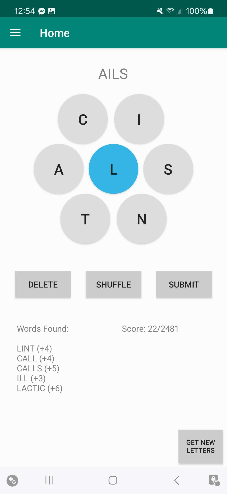
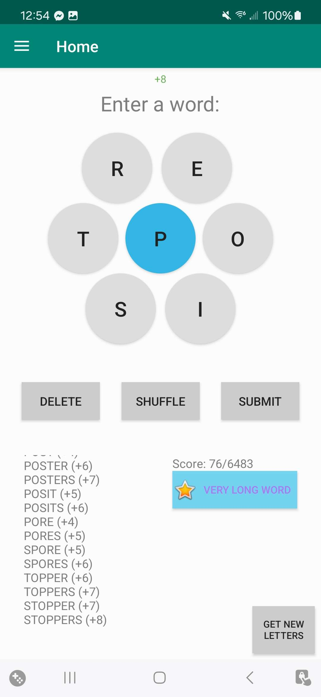
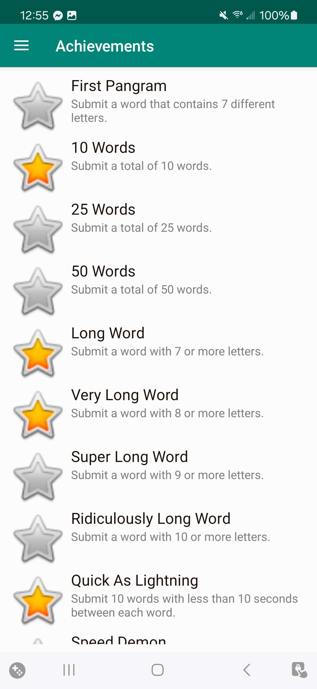

## Pangrams Word Game

### App Description
Button-based mostly fully functional word game inspired by the <a href = "https://www.nytimes.com/puzzles/spelling-bee">New York Times Spelling Bee</a>. Created in Android Studio using Java. 

Currently published on the Google Play Store. Check it out <a href = "https://play.google.com/store/apps/details?id=com.pangramsgame.firstapp">here</a>!

  Features:  Score Tracker Achievement System Saved Progress 
Settings page In-game music Night mode

### Most Recent APK
Download <a href = "https://github.com/lo-maxwell/PangramsGame/blob/master/app-debug.apk">here</a>.

### Gameplay screenshots

